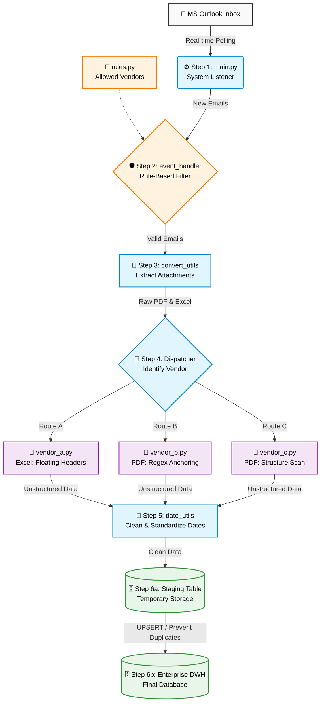

# 🚀 Enterprise Event-Driven ETL Pipeline (Production Extract)

> ⚠️ **Portfolio & NDA Notice:** This repository is a portfolio-safe, anonymized extract of a live production ETL system developed for a global enterprise. All proprietary vendor identities, specific email domains, and confidential document structures have been fully redacted. Because the architecture relies on a live corporate MS Exchange environment and processes highly specific business attachments (PDF/Excel), **it is not intended to be executed out-of-the-box.** It is shared solely to demonstrate software architecture, OOP design, and data engineering concepts.

---

## 📌 Executive Summary & Business Impact
This repository contains the core engine of an automated, enterprise-grade ETL pipeline engineered to autonomously ingest, normalize, and store highly unstructured business data streams.

## ⚡ Pipeline Overview
**Email** ➡️ **Attachment** ➡️ **Parsing** ➡️ **Normalization** ➡️ **DWH**

## 📈 Production Impact & Metrics
* **500–800 Docs/Day** — Automated real-time processing of complex business payloads.
* **9 Global Vendors** — Resilient handling of volatile, ever-changing document formats.
  *(Note: This repository is a technical extract featuring **3 anonymized vendors** for demonstration).*
* **0% Error Rate** — Complete elimination of human data-entry mistakes.
* **20+ Hours Saved/Week** — Transformed a massive operational bottleneck into a zero-touch, automated flow.

---

## 🔍 Code Walkthrough (Where to look)
To quickly evaluate the technical depth of this project, I recommend reviewing the following core modules:
1. **[convert_dispatcher.py](email_processor/core/convert_dispatcher.py):** Demonstrates the **Strategy Design Pattern** for dynamic payload routing without hardcoding vendor logic.
2. **[vendor_b.py](email_processor/vendors/vendor_b.py):** Showcases **Resilient Parsing**. Notice how it avoids hardcoded Excel coordinates, instead dynamically scanning for floating headers and using Regex for multi-page PDF extraction.
3. **[db_utils.py](email_processor/utils/db_utils.py):** Contains the **Idempotent Storage** logic, using a Staging-to-Production `UPSERT` SQL pattern to guarantee data integrity. 

---

## 🏗 System Architecture & Data Flow

The project strictly adheres to **SOLID principles** and utilizes decoupled architecture for high scalability.



---

## 📂 Project Structure

```text
email_processor/
├── core/
│   ├── main.py                   # System entry point & daemon loop
│   ├── event_handler.py          # Email event listener & metadata extraction
│   └── convert_dispatcher.py     # Strategy Pattern implementation
├── vendors/
│   ├── base_converter.py         # Abstract Base Class for all parsers
│   ├── vendor_a.py               # Custom logic for Vendor A
│   ├── vendor_b.py               # Custom logic for Vendor B
│   └── vendor_c.py               # Custom logic for Vendor C
└── utils/
    ├── convert_utils.py          # Safe OS-level file extraction
    ├── date_utils.py             # Global temporal normalization engine
    └── db_utils.py               # Idempotent database operations
```

---

## ⚙️ Key Engineering Features

* **Event-Driven Architecture:** Replaced inefficient Cron-based polling with a real-time **MAPI listener**. The system reacts instantaneously to incoming events, utilizing an atomic processing cache to guarantee **zero race conditions**.
* **Idempotent Data Pipeline:** Implements a robust **Staging-to-Production** workflow. Data is ingested into temporary tables and merged into the master DWH using a transactional `UPSERT` pattern, ensuring **100% data integrity** even during re-runs.
* **Resilient Parsing Logic**
    * **Excel:** Utilizes dynamic keyword scanning to locate "floating" headers, making the parser immune to row/column shifts by vendors.
    * **PDF:** Combines `pdfplumber` structural analysis with positional Regex tracking to handle non-standardized multi-page layouts.
* **Intelligent Sanitization:** A centralized `date_utils.py` engine normalizes **12+ international date formats** (including text-heavy strings) into strict ISO 8601 standards.
* **Scalable OOP Design:** Built on the **Strategy Design Pattern**. Adding support for a new vendor requires zero modification to the core engine—simply register a new class inheriting from the `BaseVendorConverter`.

---

## 🛠️ Tech Stack

| Category | Tools |
| :--- | :--- |
| **Language** | Python 3.10+ |
| **Data Processing** | `Pandas`, `pdfplumber`, `OpenPyXL`, `Regex` |
| **System Integration** | `pywin32` (MAPI / MS Outlook COM Interface) |
| **Persistence** | `SQLite3` (Lightweight DWH for demonstration) |
| **Environment** | `OS-level Sandboxing`, `Tempfile Management` |

---

<div align="center">

**Developed by Igor Baranov** *Enterprise Automation & Data Engineering*

[](https://www.linkedin.com/in/igor-baranow/)
[](https://github.com/IgorBaranow)

</div>
